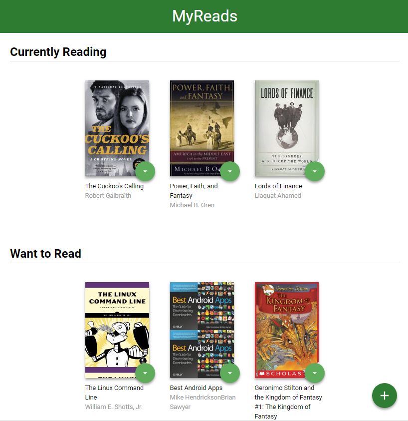

# UdacityReact
This project has been created in frame of the [Udacity React Nanodegree](https://eu.udacity.com/course/react-nanodegree--nd019) course. The project provide you a react based UI where you can add and organize your books into predefined categories.
## Install
What you have to do to start developing:
* Install [Node.js](https://nodejs.org/en/download/)
* Navigate into your repository and install all dependencies with `npm install`
* Start the development server with `npm start`

## Usage
Once you started the development server the main page will be visible in your browser or you can reach it in the [localhost:3000](localhost:3000) address by default.

* You can organize your books into three predefined category on the main page.
* On the search page you could find new books and you can assign them to one of the predefined category.

## Important
The backend API uses a fixed set of cached search results and is limited to a particular set of search terms, which can be found in [SEARCH_TERMS.md](docs/SEARCH_TERMS.md). That list of terms are the _only_ terms that will work with the backend, so don't be surprised if your searches for Basket Weaving or Bubble Wrap don't come back with any results.
## License
It is free software, and may be redistributed under the terms specified in the [LICENSE](docs/LICENSE.md) file.
